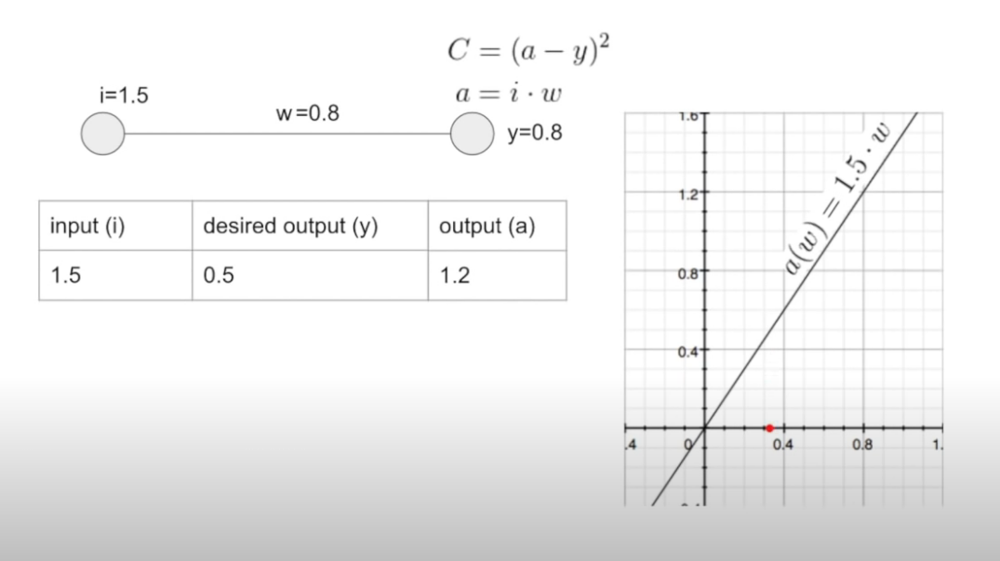

# Machine Learning
Esse repositório tem o intuito de guiar interessados em aprender *Machine Learning*. 
Ele foi feito com base nos conhecimentos adquiridos pelos petianos que trabalharam no [Projeto Papagaio](https://github.com/petcomputacaoufrgs/papagaio).
### Tabela de conteúdos
**[Introdução](#introdução)** 
**[Redes Neurais](#redes-neurais)** 
**[LSTM](#lstm)** 

## Introdução
Na programação convencional, damos ordens para o computador fazer uma tarefa para gerar um resultado. Com Machine Learning, nós damos o resultado para o computador, e deixamos ele aprender o melhor jeito de fazer a tarefa. Machine Learning nos permite fazer coisas (...).

(videos)

E mesmo com conhecimentos básicos, também conseguimos fazer coisas incríveis:

(videos)

### Pré requisitos
Álgebra linear, conceitos de derivada, python, numpy 

### Recomendações
[Coursera - Supervised Machine Learning: Regression and Classification](https://www.coursera.org/learn/machine-learning?specialization=machine-learning-introduction): esse curso é uma excelente base para quem está começando, porque ele aborda tudo que é necessário aprender de uma forma bem didática, com exercícios teóricos e práticos. Entretanto, as aulas podem acabar sendo muito pesadas, pois o conteúdo é apresentado detalhadamente.  
[Curso de Machine Learning - PET Computação](https://petcompufrgs.github.io/ml-course/): desenvolvido pelo ex-petiano Thiago, esse curso encapsula todos os conceitos de Machine Learning sucintamente, em forma de texto. É um excelente material para complementar os estudos de Machine Learning.

## Redes Neurais
Regressão linear e regressão logística são apenas a ponta do iceberg na área de Machine Learning. Com esses modelos, temos claras limitações devido à falta de complexidade. Nesse contexto, as redes neurais foram desenvolvidas para que se pudesse construir modelos muito mais profundos, capazes de resolver uma gama muito maior de problemas.  
Para conseguir entender as redes neurais, é extremamente necessário que você, após entender a teoria, bote a mão na massa e tente fazer suas próprias redes, a fim de entender como todo o processo dela funciona.  
Abaixo temos duas abas, recomendamos que você veja os vídeos para aprender a teoria, e depois tentem fazer os códigos por conta, apenas consultando quando surgirem dúvidas. 

### Recomendações
[Redes neurais - 3b1b](https://www.youtube.com/playlist?list=PLZHQObOWTQDNU6R1_67000Dx_ZCJB-3pi): é uma ótima série de vídeos para se ter uma visão inicial sobre os conceitos de Redes Neurais. Recomenda-se começar o estudo de Redes Neurais com essa playlist.

[Coursera - Advanced Learning Algorithms](https://www.coursera.org/learn/advanced-learning-algorithms?specialization=machine-learning-introduction#syllabus)

### Exercícios para fixação
Redes neurais são extremamente complicadas de entender sem praticar, principalmente a parte de backpropagation, que envolve muita matemática. 
Segue abaixo uma lista de exercícios para praticar a construção de Redes Neurais. 
Exercício 1:
Desenvolva uma rede neural trivial para obter o valor desejado de y, conforme imagem abaixo:

O *learning rate* e o número de épocas fica a seu critério. Os valores da imagem são apenas como referência.
É recomendado tentar resolver esse exercício de maneira simples, apenas utilizando um laço *for* para iterar por múltiplas épocas do treino. O objetivo desse exercício é ter um primeiro contato com o forward e backward pass.

Exercício 2:
Modifique o exercício anterior, adicionando mais neurônios, conforme a imagem abaixo:

### Resoluções dos exercícios
[Exercícios 1 e 2](dummy_neural_network.ipynb)

 

## LSTM
